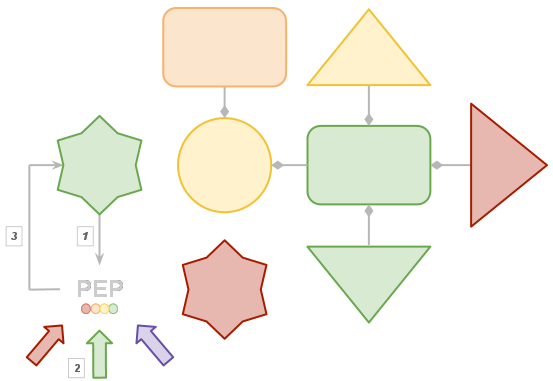

======================
Resource Status System
======================
   
.. contents:: Table of contents
   :depth: 3

------------
Introduction
------------

The **Resource Status System**, from now **RSS**, is an autonomous policy 
system acting as a central status information point for grid elements.

The *DIRAC* **RSS** is a monitoring and generic policy system that 
enforces managerial and operational actions automatically. As a matter of example, 
the status of a grid entity can be evaluated against a number of policies, which 
make assessments relative to monitoring information. Individual results can be 
combined to propose a new status for the resource. This proposal goes through a 
validation step governed by a state machine and an external validation system. 
Once validated, actions can be triggered accordingly.

Motivation
==========

There is a big, huge, enormous variety of monitoring information sources, such 
as:

  - Dashboard_
  - Lemon_
  - GocDB_
  - SLS_
  - SAM_
  - `IT support service status`_
  - ServiceMap_
  - `Lb Run Status`_
  - ...

and the list continues until a number of ~30 links, exposing all them at least 
one end-point and if we are unlucky, several. Moreover, if we step back and look 
at all the end points, there is no single easy recognisable pattern on their APIs, 
information display, etc... Let's say it is an environment that has a very high 
entropy.

On one hand, that list is checked every day by shifters, sites contact persons, 
etc... The need for a monitoring information aggregator is clear. On the other,
how do we interpret the information on that list will determine our knowledge
of the environment. This is done following well known procedures, that can be
easily automated converting them into policies.

---------------------
Underlying components
---------------------

Any *DIRAC System* makes use of databases, services, clients and agents, which are
the four pillars of *DIRAC* architecture. But in order to achieve its goal, the 
**RSS** makes use of a few concepts which are the heart of this system:

  - `Grid ontology`_
  - `State machine`_
  - `Policies`_
  - `Policy system`_
  - `Token ownership`_

The configuration applied to those three concepts will determine the behavior of
the *RSS* and the results we will get out of it.

.. seealso:: If you want to know more about the configuration, this is your link.

On our ontology we define a set of classes that will model accurately the grid
for the **RSS** purposes. Each individual belongs to a single class, and may be
related or not with other individuals of different classes. A common attribute
for every individual is the status, which may not be unique, but at least every
one will have one type of status. The transitions between the different values
for the status type of every individual are narrowed, or better, forced by a state
machine. Here is where policies come in; they are in charge of triggering the
state changes for individuals. 

Let's take a closer look !

On the image above we have a dummy ontology, which represents a dummy environment.
The ontology has four different classes: *circle*, *rectangle*, *triangle* and *star*, which
are connected, in this case, by composition relations. But, of course, any relation that is
suitable to model the environment fits on **RSS**. 

.. note::   
  
    Let's take as an example the circle and the two rectangles: we could say the 
    rectangles are part of the circle, but it would not be accurate enough, that is 
    an aggregation relationship. The composition relation we are talking about makes 
    senseless to have rectangles without a circle. The rectangles are part of the
    circle life cycle.
 
Four classes, one individual of class *circle*, two individuals of class *star*,
two individuals of class *rectangle* and three of class *triangle*. Each one of them
has at least one status type, which is the property of having a color, being the 
color itself the status. The initial statuses on the environment are *green*, *blue*, 
*yellow* and *red*. Moreover, if we look at the triangles, we will see they have another
status type, which is position. The values for this status type are *+90*, *+0* and *-90*
for the individuals shown.

.. note::
  
    All the individuals of the same class have the same status types, it may sound 
    too obvious, but just in case. So, all triangles have color and position status
    types.
    
At this point, we have a simplified version of the policies, the policy system and
the state machine. The Policy Enforcement Point, PEP from now, is the visible part
of the policy system, and collects per individual its status plus the outputs of the
relevant policies. In this case, we have three policies returning statuses *red*, *green* 
and *purple*. The PEP makes it's magic, and a new status for the status type color is proposed.
Finally, but not less important, the state machine integrated with the policy system
will ensure that the color *purple* never reaches the individual, as only *red*, *yellow*,
*blue* and *green* are allowed.

Grid ontology
=============

We must define how does our environment look like, **RSS** is smart but it has not
crossed that line yet. This  

State Machine
=============

Policies
========

Policy System
=============

Token Ownership
===============

------------

:Author:  Federico Stagni <federico.stagni@SPAMNOTcern.ch>, Mario Ubeda Garcia <mario.ubeda.garcia@SPAMNOTcern.ch>, Vincent Bernardoff <vincent.bernardoff@SPAMNOTcern.ch>
:Date:    Thu, 20 Oct 2011
:Version: v0r1

.. IMAGES

.. |DIRACfavicon| image:: ../../../_static/favicon.ico
 
        
.. HYPERLINKS

.. _Dashboard: http://dashb-lhcb-ssb.cern.ch/dashboard/request.py/siteviewhome?view=Job%20Activities
.. _Lemon: http://lemonweb.cern.ch/lemon-web/
.. _GocDB: https://goc.egi.eu/portal/
.. _SLS: http://sls.cern.ch/sls/index.php
.. _SAM: http://dashb-lhcb-sam.cern.ch/dashboard/request.py/latestresultssmry-sum
.. _`IT support service status`: http://itssb.web.cern.ch/
.. _ServiceMap: http://servicemap.cern.ch/ccrc08/servicemap.html
.. _`Lb Run Status`: http://lbrundb.cern.ch/
  
